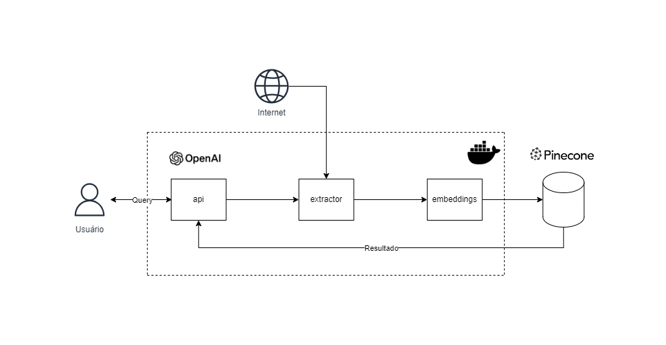

# RAG com Open AI e Pinecone

## Desenho de arquitetura da solução



A solução consiste em uma arquitetura RAG (Retrieval-Augmented Generation), o qual possui as seguintes componentes:
- componente `extractor` para extração de texto de uma URL;
- a componente `embeddings` para realização de chunks, embeddings e upsert dos vetores no banco de dados vetorial do Pinecone (https://www.pinecone.io/);
- e a componente `api` que realiza a recuperação por busca semântica no banco de dados vetorial, e que utiliza o `gpt-3.5-turbo` da Open AI (https://platform.openai.com/docs/overview) para responder perguntas da base de conhecimento utilizada;  

As três componentes são provisionadas localmente com `docker-compose.yml`.

O projeto foi desenvolvido com a seguinte stack: Python, Docker, Open AI, Pinecode, git e GitHub Actions.

Estrutura do repositório:

```
├── README.md
├── data
├── diagrama
│   ├── diagrama.drawio
│   └── diagrama.png
├── docker-compose.yml
└── src
    ├── api
    │   ├── Dockerfile
    │   ├── app.py
    │   ├── requirements.txt
    │   └── tests
    │       └── test_app.py
    ├── embeddings
    │   ├── Dockerfile
    │   ├── app.py
    │   ├── requirements.txt
    │   └── tests
    │       └── test_app.py
    └── extractor
        ├── Dockerfile
        ├── app.py
        ├── requirements.txt
        └── tests
            └── test_app.py
```

Para execução do presente projeto, é preciso clonar o repositório:

```bash
git clone https://github.com/plbalmeida/qa-llm-hotmart.git
```

É necessário inserir as secrets keys do Pinecone e da Open AI no arquivo `.env` na raíz do repositório:

```.env
OPENAI_API_KEY=
PINECONE_API_KEY=
```

Após é necessário executar no terminal o seguinte comando na raíz do respositório para fazer o build do `docker-compose.yml` para provisionar as aplicações necessárias:

```bash
docker-compose up --build
```

Após a execução, é esperado que as aplicações estejam rodando localmente, executando o comando `docker ps` no terminal, é esperado o seguinte retorno o qual evidencia que cada aplicação está rodando:

```bash
CONTAINER ID   IMAGE                       COMMAND           CREATED          STATUS          PORTS                    NAMES
df4754ff4315   qa-llm-hotmart-api          "python app.py"   18 minutes ago   Up 18 minutes   0.0.0.0:5000->5000/tcp   api
1e19501c67e9   qa-llm-hotmart-embeddings   "python app.py"   18 minutes ago   Up 18 minutes   0.0.0.0:5002->5002/tcp   embeddings
ea682709e06f   qa-llm-hotmart-extractor    "python app.py"   18 minutes ago   Up 18 minutes   0.0.0.0:5001->5001/tcp   extractor
```

Com a execução do serviço `extract`, a extração de texto da URL fornecida é persistida no diretório `data`:
```bash
curl -X POST \
    http://localhost:5001/extract \
    -H "Content-Type: application/json" \
    -d '{"url": "https://hotmart.com/pt-br/blog/como-funciona-hotmart"}'
```

Com a execução do serviço `embed`, é realizado os chunks do texto original, embedding com API da Open AI e upsert dos vetores no Pinecone: 
```bash
curl -X POST \
    http://localhost:5002/embed \
    -H "Content-Type: application/json" \
    -d '{"file_path": "data/extracted_text.txt"}'
```

Por fim, com a execução da aplicação `qa`, é possível usar GPT da Open AI para fazer perguntas sobre o domínio do texto encontrado na URL fornecida:  
```bash
curl -X POST \
    http://localhost:5000/qa \
    -H "Content-Type: application/json" \
    -d '{"question": "O que a Hotmart faz?"}'
```

É esperado com o retorno algo semelhante a resposta a seguir:

```bash
{
    "answer": "A Hotmart oferece uma plataforma EAD que hospeda cursos online, processa pagamentos online, oferece soluções para escalar negócios digitais, automatiza processos de publicação, distribuição e pagamento, e fornece ferramentas para aumentar as vendas, como Order Bump e Funil de Vendas. Além disso, a Hotmart é um ecossistema completo em constante evolução para trazer soluções para criar e escalar negócios digitais."
}
```

Para desligar as aplicações, executar no terminal:

```bash
docker-compose down
```

## Contribuições

Contribuições são bem-vindas. Para contribuir, por favor, crie um pull request para revisão.