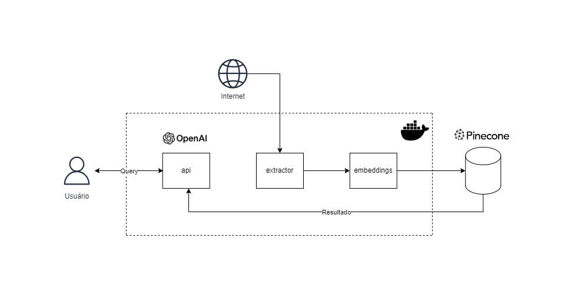
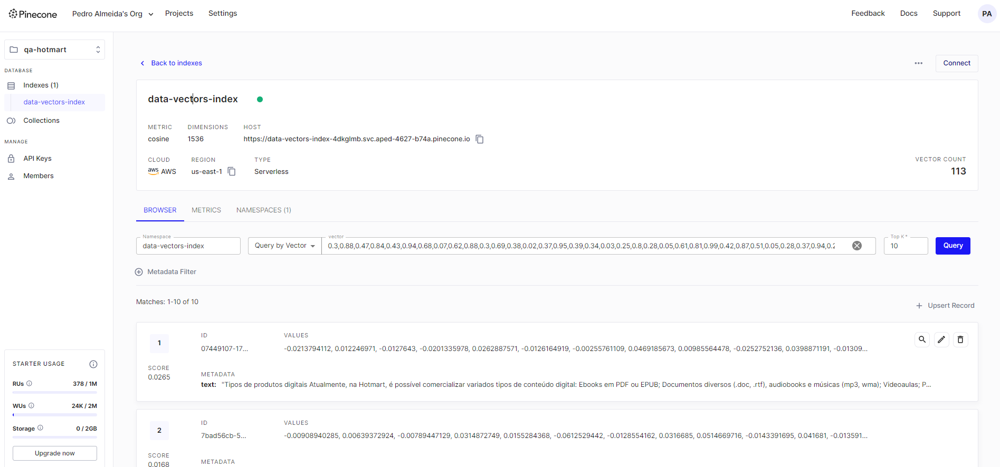
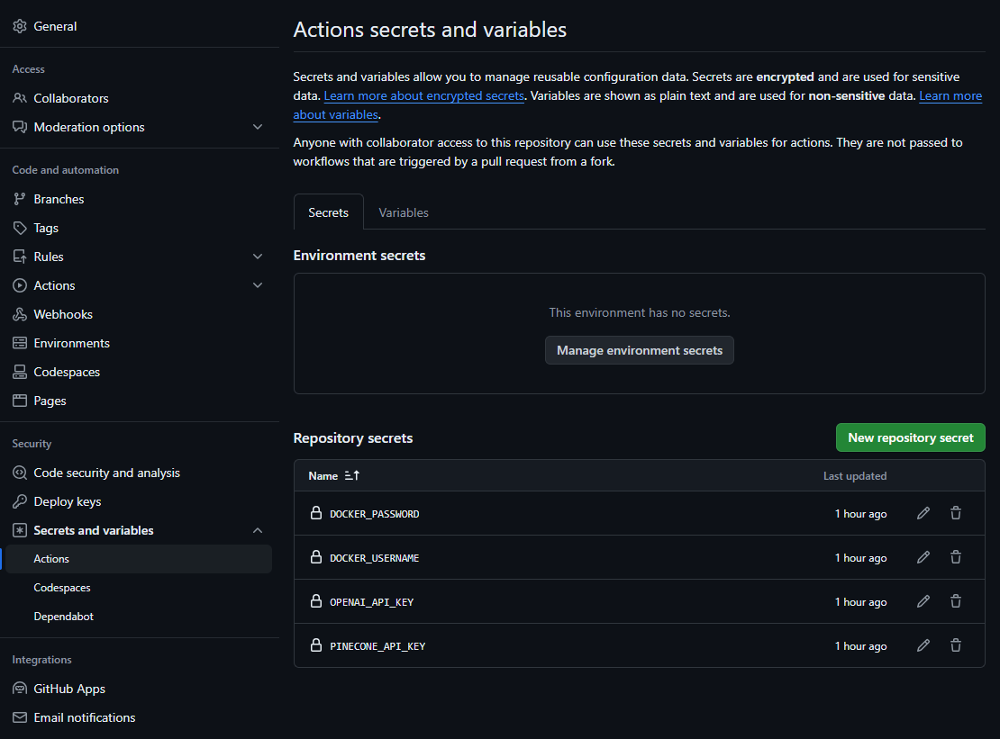
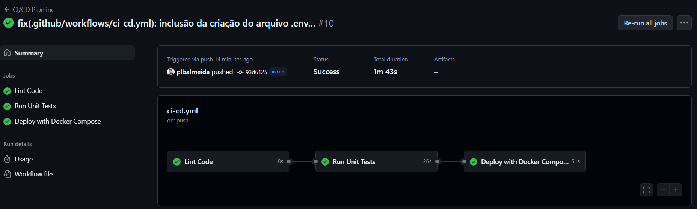

# RAG com Open AI e Pinecone

## Desenho de arquitetura da solução



A solução consiste em uma arquitetura RAG (Retrieval-Augmented Generation), o qual possui as seguintes componentes:
- componente `extractor` para extração de texto de uma URL;
- a componente `embeddings` para realização de chunks, embeddings e upsert dos vetores no banco de dados vetorial do Pinecone (https://www.pinecone.io/);
- e a componente `api` que realiza a recuperação por busca semântica no banco de dados vetorial, e que utiliza o `gpt-3.5-turbo` da Open AI (https://platform.openai.com/docs/overview) para responder perguntas da base de conhecimento utilizada;  

As três componentes são provisionadas localmente com `docker-compose.yml`.

O projeto foi desenvolvido com a seguinte stack: 
- `**Python**`: para criação dos scripts e implementação da solução;
- `**Docker**`: para containerizar a solução;
- `**Open AI**`: como a API de modelo treinado de LLM para a geração de texto e tarefa de embedding;
- `**Pinecode**`: para banco de dados de vetores;
- `**git**`: para versionamento de código;
-`**GitHub Actions**`: para esteira de CI/CD, nesse projeto o foco maior é para a parte de CI;

Oprojeto tem a seguinte estrutura do repositório:

```
├── README.md
├── data
├── diagrama
│   ├── diagrama.drawio
│   └── diagrama.png
├── docker-compose.yml
└── src
    ├── api
    │   ├── Dockerfile
    │   ├── app.py
    │   ├── requirements.txt
    │   └── tests
    │       └── test_app.py
    ├── embeddings
    │   ├── Dockerfile
    │   ├── app.py
    │   ├── requirements.txt
    │   └── tests
    │       └── test_app.py
    └── extractor
        ├── Dockerfile
        ├── app.py
        ├── requirements.txt
        └── tests
            └── test_app.py
```

Para execução do presente projeto, é preciso clonar o repositório:

```bash
git clone https://github.com/plbalmeida/qa-llm-hotmart.git
```

É necessário inserir as secrets keys do Pinecone e da Open AI no arquivo `.env` na raíz do repositório:

```.env
OPENAI_API_KEY=
PINECONE_API_KEY=
```

Após é necessário executar no terminal o seguinte comando na raíz do respositório para fazer o build do `docker-compose.yml` para provisionar as aplicações necessárias:

```bash
docker-compose up --build
```

Após a execução, é esperado que as aplicações estejam rodando localmente, executando o comando `docker ps` no terminal, é esperado o seguinte retorno o qual evidencia que cada aplicação está rodando:

```bash
CONTAINER ID   IMAGE                       COMMAND           CREATED          STATUS          PORTS                    NAMES
df4754ff4315   qa-llm-hotmart-api          "python app.py"   18 minutes ago   Up 18 minutes   0.0.0.0:5000->5000/tcp   api
1e19501c67e9   qa-llm-hotmart-embeddings   "python app.py"   18 minutes ago   Up 18 minutes   0.0.0.0:5002->5002/tcp   embeddings
ea682709e06f   qa-llm-hotmart-extractor    "python app.py"   18 minutes ago   Up 18 minutes   0.0.0.0:5001->5001/tcp   extractor
```

Com a execução do serviço `extract`, a extração de texto da URL fornecida é persistida no diretório `data`:
```bash
curl -X POST \
    http://localhost:5001/extract \
    -H "Content-Type: application/json" \
    -d '{"url": "https://hotmart.com/pt-br/blog/como-funciona-hotmart"}'
```

Com a execução do serviço `embed`, é realizado os chunks do texto original, embedding com API da Open AI e upsert dos vetores no Pinecone: 
```bash
curl -X POST \
    http://localhost:5002/embed \
    -H "Content-Type: application/json" \
    -d '{"file_path": "data/extracted_text.txt"}'
```

Com isso é esperado o upsert dos vetores no Pinecone:



Por fim, com a execução da aplicação `qa`, é possível usar GPT da Open AI para fazer perguntas sobre o domínio do texto encontrado na URL fornecida:  
```bash
curl -X POST \
    http://localhost:5000/qa \
    -H "Content-Type: application/json" \
    -d '{"question": "O que a Hotmart faz?"}'
```

É esperado com o retorno algo semelhante a resposta a seguir:

```bash
{
    "answer": "A Hotmart oferece uma plataforma EAD que hospeda cursos online, processa pagamentos online, oferece soluções para escalar negócios digitais, automatiza processos de publicação, distribuição e pagamento, e fornece ferramentas para aumentar as vendas, como Order Bump e Funil de Vendas. Além disso, a Hotmart é um ecossistema completo em constante evolução para trazer soluções para criar e escalar negócios digitais."
}
```

Mais um exemplo de uso da aplicação:

```bash
curl -X POST \
    http://localhost:5000/qa \
    -H "Content-Type: application/json" \
    -d '{"question": "Como os clientes s beneficiam em hospedar seus serviços na Hotmart"}'
```

É esperado com o retorno semelhante a resposta a seguir:

```bash
{
    "answer": "Os clientes se beneficiam ao hospedar seus serviços na Hotmart de várias maneiras. Alguns dos benefícios incluem faturar 35% a mais sem aumentar o esforço operacional, ter acesso a uma plataforma EAD que hospeda cursos online e processa pagamentos online em um só lugar, contar com soluções para escalar negócios digitais, ter um relacionamento mais próximo com clientes reais e potenciais, não precisar contratar especialistas para desenvolver sistemas complexos, simplificar processos para focar na qualidade do conteúdo, definir horários de trabalho e utilizar técnicas de divulgação de produtos. Além disso, a Hotmart oferece infraestrutura de armazenamento segura, solução exclusiva para pagamentos online (inclusive internacionais), entrega automatizada de conteúdos aos compradores, distribuição automática de comissões para afiliados e diversas ferramentas para aumentar as vendas, como Order Bump e Funil de Vendas."
}
```

Para desligar as aplicações, executar no terminal:

```bash
docker-compose down
```

## Esteira de CI/CD

Foi criada um esteira de CI/CD com jobs de lint para checagem de estilo do código, testes unitários e deploy.

Para funcionar, é necessário colocar as chaves no secrets do projeto:



Ao realizar o merge para branch `main`, o mesmo é executado:



Reforçando que para esse projeto, o job de deploy não coloca a aplicação em nenhum serviço, nesse projeto o foco maior é para a parte de CI. Para checar o funcionamento local da aplicação, executar o comando `docker-compose up --build` como mencionado anteriormente.

## Sugestões de melhoria da aplicação

Algumas sugestões de melhoria:

- Adicionar mais testes unitários: adicionar mais testes para cobrir cenários adicionais e garantir uma maior cobertura de código;
- Cobertura de testes: criação de job de checagem de cobertura de testes pelas aplicações na esteira de CI/CD;
- Automação de deploy em diferentes ambientes: automatizar o deploy para diferentes ambientes (desenvolvimento, homologação, produção) com diferentes pipelines;
- Monitoração e alertas: configuração de monitoramento e alertas para avaliação de performarce dos serviços e do modelo de LLM provisionado;

## Contribuições

Contribuições são bem-vindas. Para contribuir, por favor, crie um pull request para revisão.